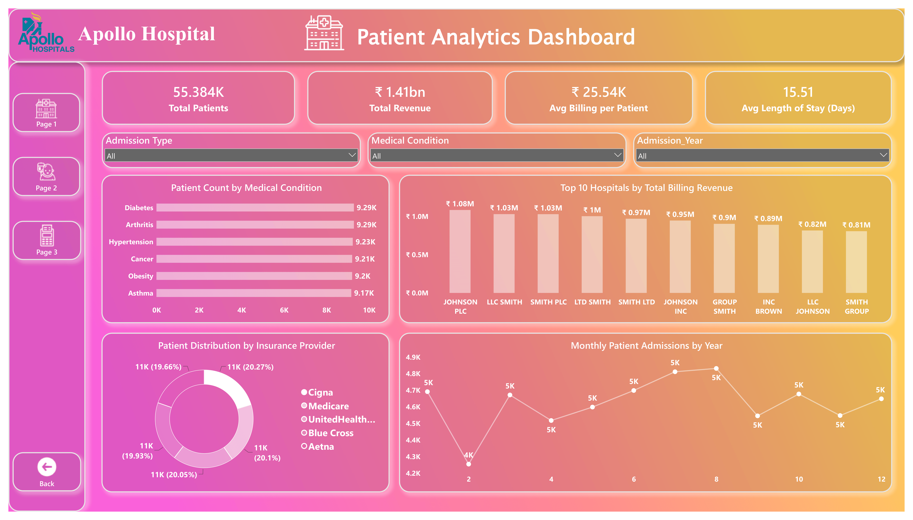
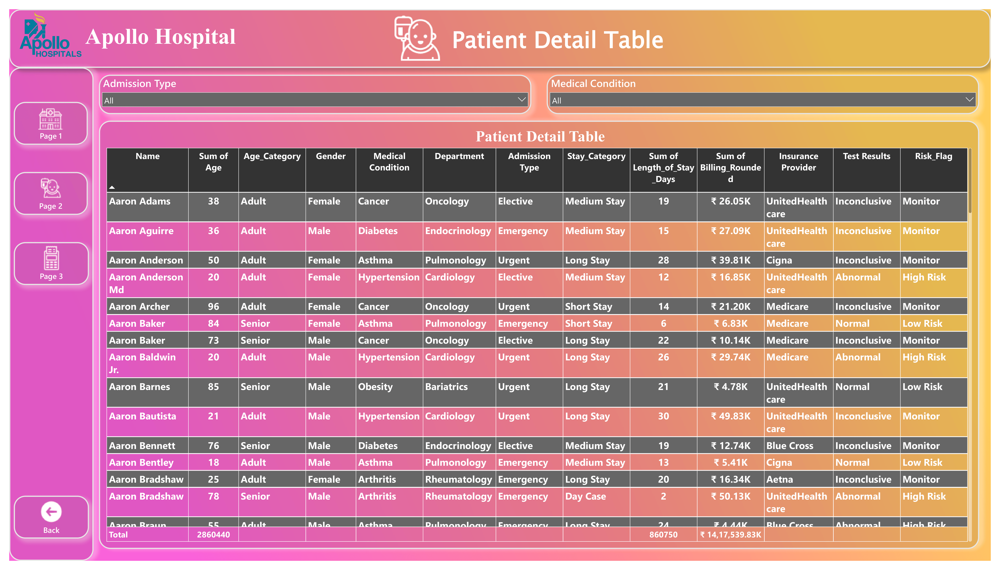
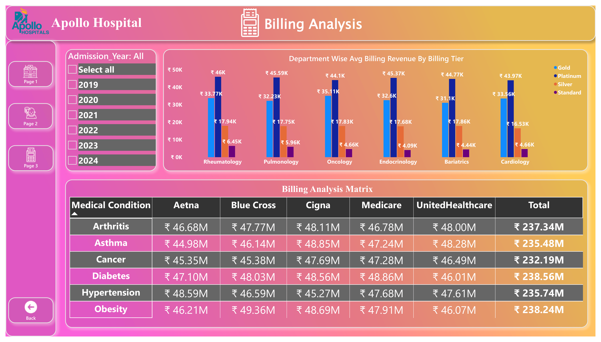

# 📊 Sales Analytics Dashboard | Power BI

<div align="center">


*A modern interactive business intelligence dashboard built with Microsoft Power BI to transform raw sales data into meaningful business insights.*

</div>

---

# 🚀 Project Overview

This project demonstrates the development of an interactive **Sales Analytics Dashboard** using **Microsoft Power BI**. The dashboard converts raw transactional data into actionable insights through interactive visualizations, dynamic KPIs, and advanced data modeling.

It enables decision-makers to monitor business performance, identify sales trends, evaluate regional performance, analyze customer behavior, and make data-driven decisions efficiently.

---

# 🎯 Objectives

- Analyze overall sales performance
- Monitor revenue and profit trends
- Track key business KPIs
- Identify top-performing products
- Compare regional sales
- Understand customer purchasing patterns
- Build an interactive and user-friendly dashboard

---

# ✨ Features

✅ Interactive Dashboard

✅ Dynamic KPI Cards

✅ Advanced DAX Measures

✅ Data Cleaning with Power Query

✅ Interactive Slicers

✅ Drill-down Analysis

✅ Time Intelligence Calculations

✅ Business Performance Insights

---

# 📸 Dashboard Preview


| Overview |
|----------|
|  |
|  |
|  |

---

# 📈 Dashboard Includes

### 📊 Sales Analysis
- Total Sales
- Total Profit
- Total Orders
- Average Order Value

### 🌍 Regional Performance
- Region-wise Sales
- Profit Distribution
- Geographic Analysis

### 🛍 Product Insights
- Top Selling Products
- Category-wise Performance
- Product Contribution

### 👥 Customer Analysis
- Customer Segmentation
- Purchase Trends
- Revenue by Customer

### 📅 Time Analysis
- Monthly Sales Trend
- Year-over-Year Growth
- Seasonal Performance

---

# 🛠 Tools & Technologies

| Tool | Purpose |
|------|---------|
| Microsoft Power BI | Dashboard Development |
| Power Query | Data Cleaning & Transformation |
| DAX | Business Calculations |
| Data Modeling | Relationships & Schema |
| Excel / CSV | Data Source |

---

# 🧠 Skills Demonstrated

- Business Intelligence
- Data Visualization
- Dashboard Design
- Data Cleaning
- Data Transformation
- Data Modeling
- DAX Calculations
- KPI Development
- Analytical Thinking
- Storytelling with Data

---

# 📂 Project Structure

```
Sales-Analytics-Dashboard/
│
├── PR_2.pbix
├── images/
│   ├── dashboard.png
│   ├── overview.png
│   └── sales.png
└── README.md
```

---

# 📊 Key Performance Indicators

| KPI | Description |
|------|------------|
| 💰 Total Sales | Overall revenue generated |
| 📦 Total Orders | Number of customer orders |
| 📈 Profit | Overall business profit |
| 👥 Customers | Total customers served |
| 🛍 Top Product | Best-performing product |
| 🌍 Best Region | Highest revenue region |

---

# 📌 Business Insights

The dashboard helps answer questions like:

- Which products generate the highest revenue?
- Which region contributes the most sales?
- What are the monthly sales trends?
- Which customer segments are most profitable?
- How has revenue changed over time?
- Where can business performance improve?

---

# ⚙️ How to Use

### 1. Clone the repository

```bash
git clone https://github.com/Pratik-Patil-AI/Hospital_Management_PR_2.git
```

### 2. Open

Open **PR_2.pbix** in **Microsoft Power BI Desktop**.

### 3. Refresh

Refresh the data if required.

---

# 📥 Requirements

- Microsoft Power BI Desktop (Latest Version)

---

# 🌟 Future Improvements

- Real-time dashboard
- Forecasting using Power BI AI visuals
- SQL Database integration
- Power BI Service deployment
- Mobile optimized report
- Automated data refresh

---

# 👨‍💻 Author

**Pratik Patil**

💼 Aspiring Data Analyst | Power BI | SQL | Excel | Python

GitHub: https://github.com/Pratik-Patil-AI

---

<div align="center">

### ⭐ If you like this project, don't forget to give it a Star!

**Thanks for visiting! Happy Analyzing 📊**

</div>
